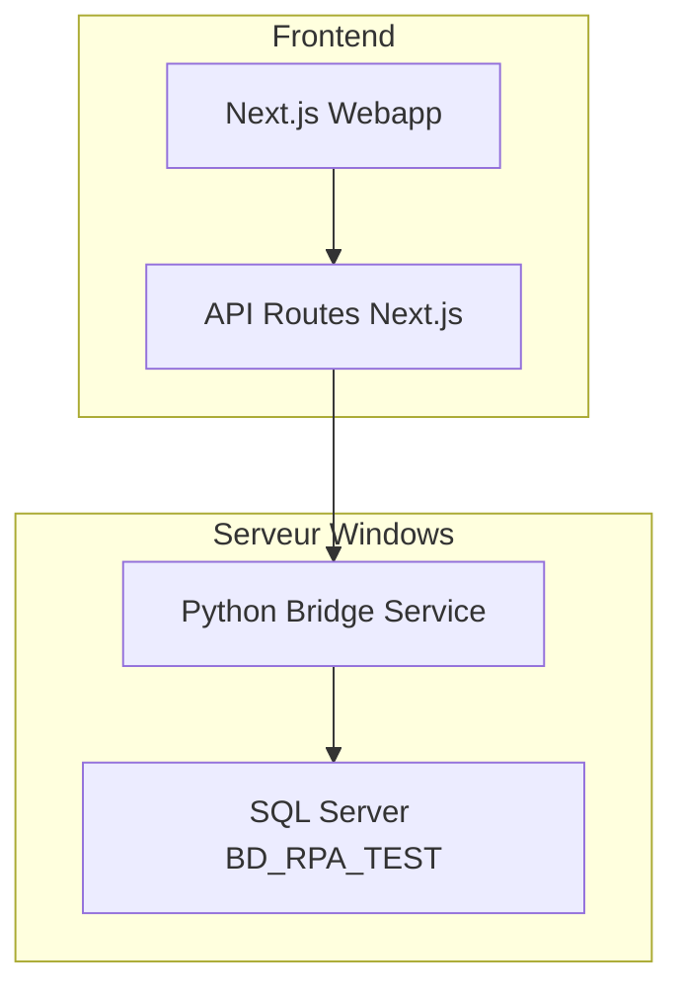

# Design Document

## Overview

Cette solution vise à établir une connexion entre une webapp Next.js et SQL Server utilisant l'authentification Windows. Le problème principal est que Node.js ne supporte pas nativement l'authentification Windows intégrée (Trusted_Connection=yes) comme le fait Python avec pyodbc.

Après analyse, plusieurs approches sont possibles :

1. **Service Bridge Python** : Créer un service intermédiaire Python qui expose une API REST
2. **Configuration MSSQL avec authentification alternative** : Utiliser des techniques de configuration avancées
3. **Proxy de connexion** : Utiliser un proxy qui gère l'authentification Windows

La solution recommandée est le **Service Bridge Python** car elle tire parti de votre code Python existant et fonctionnel.

## Architecture

### Architecture Globale



### Flux de Données

1. **Frontend** → API Routes Next.js
2. **API Routes** → Python Bridge Service (HTTP/REST)
3. **Python Bridge** → SQL Server (pyodbc + Windows Auth)
4. **Réponse** suit le chemin inverse

## Components and Interfaces

### 1. Python Bridge Service

**Responsabilités :**
- Gérer les connexions SQL Server avec authentification Windows
- Exposer une API REST pour les opérations de base de données
- Gérer la sécurité et la validation des requêtes
- Maintenir un pool de connexions efficace

**Technologies :**
- FastAPI ou Flask pour l'API REST
- pyodbc pour la connexion SQL Server
- uvicorn comme serveur ASGI

**Endpoints principaux :**
```
GET /api/citations - Récupérer les citations
GET /api/citations/{id} - Récupérer une citation spécifique
POST /api/query - Exécuter une requête SQL personnalisée (sécurisée)
GET /api/health - Vérification de santé du service
```

### 2. Next.js API Routes

**Responsabilités :**
- Servir d'interface entre le frontend et le Python Bridge
- Gérer l'authentification et l'autorisation côté webapp
- Transformer les données si nécessaire
- Gérer les erreurs et les timeouts

**Structure :**
```
app/api/
├── citations/
│   ├── route.ts
│   └── [id]/route.ts
├── database/
│   └── query/route.ts
└── health/route.ts
```

### 3. Frontend Components

**Responsabilités :**
- Afficher les données récupérées
- Gérer les états de chargement et d'erreur
- Fournir une interface utilisateur intuitive

## Data Models

### Citation Model
```typescript
interface Citation {
  ID: number;
  CITATION: string;
  AUTEUR: string;
}
```

### API Response Models
```typescript
interface ApiResponse<T> {
  success: boolean;
  data?: T;
  error?: string;
  timestamp: string;
}

interface QueryRequest {
  query: string;
  parameters?: Record<string, any>;
}
```

## Error Handling

### Stratégie d'Erreur en Cascade

1. **Python Bridge Service**
   - Erreurs de connexion SQL Server
   - Erreurs de requête SQL
   - Erreurs d'authentification Windows

2. **Next.js API Routes**
   - Erreurs de communication avec le Python Bridge
   - Erreurs de validation des paramètres
   - Timeouts de requête

3. **Frontend**
   - Affichage d'erreurs utilisateur-friendly
   - Retry automatique pour les erreurs temporaires
   - Logging côté client pour le débogage

### Codes d'Erreur Standardisés
```typescript
enum ErrorCodes {
  DATABASE_CONNECTION_FAILED = 'DB_CONN_001',
  AUTHENTICATION_FAILED = 'AUTH_001',
  QUERY_EXECUTION_FAILED = 'QUERY_001',
  BRIDGE_SERVICE_UNAVAILABLE = 'BRIDGE_001'
}
```

## Testing Strategy

### 1. Tests Unitaires
- **Python Bridge** : Tests des fonctions de connexion et requêtes
- **Next.js API Routes** : Tests des endpoints et transformations de données
- **Frontend Components** : Tests de rendu et interactions

### 2. Tests d'Intégration
- Communication Next.js ↔ Python Bridge
- Connexion Python Bridge ↔ SQL Server
- Tests end-to-end du flux complet

### 3. Tests de Performance
- Temps de réponse des requêtes
- Gestion de la charge simultanée
- Optimisation du pool de connexions

## Security Considerations

### 1. Authentification et Autorisation
- Le Python Bridge s'exécute avec les permissions Windows appropriées
- Validation stricte des requêtes SQL pour prévenir les injections
- Rate limiting sur les API endpoints

### 2. Communication Sécurisée
- Communication HTTPS entre Next.js et Python Bridge
- Validation des paramètres d'entrée
- Sanitisation des réponses

### 3. Gestion des Secrets
- Configuration via variables d'environnement
- Pas de credentials hardcodés
- Rotation des clés d'API si nécessaire

## Deployment Strategy

### 1. Python Bridge Service
- Déploiement sur le même serveur Windows que la webapp
- Configuration comme service Windows pour démarrage automatique
- Port dédié (ex: 8001) pour la communication interne

### 2. Next.js Webapp
- Configuration des variables d'environnement pour pointer vers le Python Bridge
- Build et déploiement standard Next.js

### 3. Monitoring
- Health checks réguliers du Python Bridge
- Logging centralisé des erreurs
- Métriques de performance