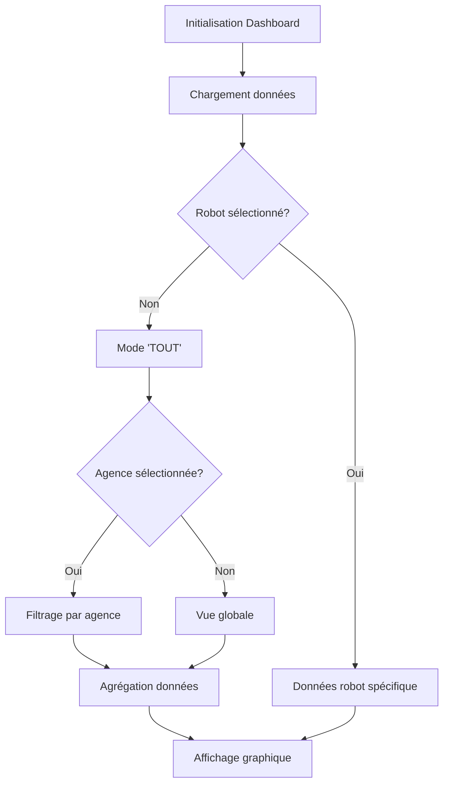

# Analyse du Mécanisme de Tri des Robots (Lorsqu'aucun robot n'est sélectionné)

## Vue d'ensemble

Le mécanisme de tri des robots lorsqu'aucun robot n'est sélectionné est géré principalement dans le composant `Dashboard.tsx`. Il implémente une logique sophistiquée qui permet d'afficher des données agrégées selon différents niveaux de granularité (agence, service, ou global).

## Architecture du système

### 1. Composants impliqués

#### 1.1 RobotSelector.tsx (lignes 1-52)
- **Fonction principale**: Affiche la liste des robots disponibles
- **Logique de tri**: 
  - Ligne 22-25: Construit une liste avec l'option "TOUT" en premier
  - Ligne 32-36: Gère l'affichage conditionnel selon la sélection

#### 1.2 Dashboard.tsx (lignes 81-800)
- **État central**: Contient tous les états de sélection et la logique de filtrage
- **Points clés**:
  - Ligne 82-92: Définition de l'objet TOUT_ROBOT
  - Ligne 111: État `robots` contenant tous les robots disponibles
  - Ligne 112: État `selectedRobot` pour le robot actuellement sélectionné

### 2. Mécanisme de tri par défaut

#### 2.1 Initialisation (lignes 153-227)
```typescript
// Dashboard.tsx - useEffect principal
const TOUT_ROBOT: Robot = {
  clef: 'TOUT',
  robot: 'TOUT',
  id_robot: 'TOUT',
  agence: 'TOUT',
  type_unite: 'unite',
  temps_par_unite: '0',
  type_gain: 'temps',
  service: 'TOUT'
};
```

#### 2.2 Logique de sélection (lignes 234-400)
Le système utilise plusieurs niveaux de filtrage:

1. **Niveau Agence**: 
   - Si `selectedAgency.codeAgence === 'TOUT'` → agrégation globale
   - Sinon → filtrage par agence spécifique

2. **Niveau Service**:
   - Si `selectedService === 'TOUT'` → tous les services
   - Sinon → filtrage par service spécifique

3. **Niveau Robot**:
   - Si `selectedRobot?.robot === 'TOUT'` → agrégation par agence/service
   - Sinon → données du robot spécifique

### 3. Fonctions de filtrage clés

#### 3.1 loadRobotData() (lignes 234-397)
```typescript
// Logique de tri conditionnel
if (currentRobot.robot === 'TOUT') {
  // Agrégation par agence sélectionnée
  const activeAgency = selectedAgency?.codeAgence || 'TOUT';
  const robotsFiltered = robots.filter(r => 
    r.robot && r.robot !== 'TOUT' && 
    (activeAgency === 'TOUT' ? true : r.agence === activeAgency)
  );
  // ... logique d'agrégation
} else {
  // Données du robot spécifique
  // ... logique de filtrage par robot
}
```

#### 3.2 loadEvolutionsForTable() (lignes 411-444)
```typescript
// Stratégie de récupération des données
if (robotName && robotName !== 'TOUT') {
  evoData = await fetchEvolutionsByRobot(robotName, selectedMonth);
} else if (robotName === 'TOUT' && agencyCode === 'TOUT') {
  evoData = await fetchAllEvolutions(); // Vue globale
} else if (robotName === 'TOUT' && agencyCode !== 'TOUT') {
  evoData = await fetchEvolutionsByAgency(agencyCode, selectedMonth);
}
```

### 4. Variables et états clés

| Variable | Type | Description | Localisation |
|----------|------|-------------|--------------|
| `TOUT_ROBOT` | Robot | Objet représentant la sélection "TOUT" | Dashboard.tsx:82-92 |
| `selectedRobot` | Robot \| null | Robot actuellement sélectionné | Dashboard.tsx:112 |
| `selectedAgency` | Agency \| null | Agence actuellement sélectionnée | Dashboard.tsx:105-108 |
| `selectedService` | string | Service actuellement sélectionné | Dashboard.tsx:109 |
| `robots` | Robot[] | Liste complète des robots disponibles | Dashboard.tsx:111 |
| `cachedReportingData` | Object | Données de reporting pour 4 mois | Dashboard.tsx:36 |

### 5. Processus de filtrage détaillé

#### 5.1 Lorsque "TOUT" est sélectionné (aucun robot spécifique)

**Étape 1: Identification du périmètre**
- Ligne 243: `const activeAgency = selectedAgency?.codeAgence || 'TOUT'`
- Détermine si on filtre par agence ou non

**Étape 2: Filtrage des robots**
- Ligne 247-248: 
```typescript
const robotsFiltered = robots.filter(r => 
  r.robot && r.robot !== 'TOUT' && 
  (activeAgency === 'TOUT' ? true : r.agence === activeAgence)
);
```

**Étape 3: Agrégation des données**
- Lignes 251-305: Construction des données agrégées
- Calcule les totaux journaliers sur 31 jours
- Construit un objet `mergedData` avec les données agrégées

#### 5.2 Structure des données agrégées
```typescript
const mergedData: DataEntry = {
  AGENCE: 'TOUT', // Indique l'agrégation
  'NOM ROBOT': activeAgency === 'TOUT' ? 'Tous les robots' : `Tous les robots - ${activeAgency}`,
  'NB UNITES DEPUIS DEBUT DU MOIS': String(totalUnitsSinceMonthStart),
  // ... données journalières agrégées
};
```

### 6. Gestion des événements

#### 6.1 Changement d'agence (lignes 447-480)
```typescript
const handleAgencyChange = (agencyCode: string) => {
  // Réinitialise le service à "TOUT"
  setSelectedService('TOUT');
  
  // Filtre les robots selon l'agence
  const robotsForAgency = cachedRobotsFromTableBaremeReport.filter(
    r => r.agence === agencySelected.codeAgence
  );
  
  // Force la sélection "TOUT" contextualisée
  const TOUT_FOR_AGENCY: Robot = {
    ...TOUT_ROBOT,
    agence: agencySelected.codeAgence,
    id_robot: `${agencySelected.codeAgence}_TOUT`
  };
};
```

#### 6.2 Changement de robot (lignes 485-522)
```typescript
const handleRobotChange = (robotID: string) => {
  if (robotID === 'TOUT' || robotID.endsWith('_TOUT')) {
    // Construction d'un robot "TOUT" contextualisé
    const activeAgencyCode = selectedAgency?.codeAgence || 'TOUT';
    const TOUT_FOR_AGENCY: Robot = {
      ...TOUT_ROBOT,
      agence: activeAgencyCode,
      id_robot: `${activeAgencyCode}_TOUT`,
    };
  }
};
```

### 7. Comportement par défaut

Lorsque le dashboard s'initialise:
1. **Sélection par défaut**: `selectedRobot = null` (initial)
2. **Force TOUT**: Le système force la sélection de "TOUT" via `setSelectedRobotDataFromBareme(TOUT_ROBOT)` (ligne 211)
3. **Affichage**: Les données affichées représentent l'agrégation de tous les robots disponibles

### 8. Points d'extension

Le mécanisme permet facilement l'ajout de:
- Nouveaux niveaux de filtrage (par région, par type de robot, etc.)
- Nouvelles métriques d'agrégation
- Nouvelles périodes de temps

### 9. Flux de données



## Conclusion

Le mécanisme de tri des robots lorsqu'aucun robot n'est sélectionné est basé sur une logique d'agrégation intelligente qui permet de visualiser les données à différents niveaux de granularité. Le système utilise l'objet "TOUT" comme marqueur pour déclencher l'agrégation et adapte automatiquement le périmètre de filtrage selon les sélections d'agence et de service.