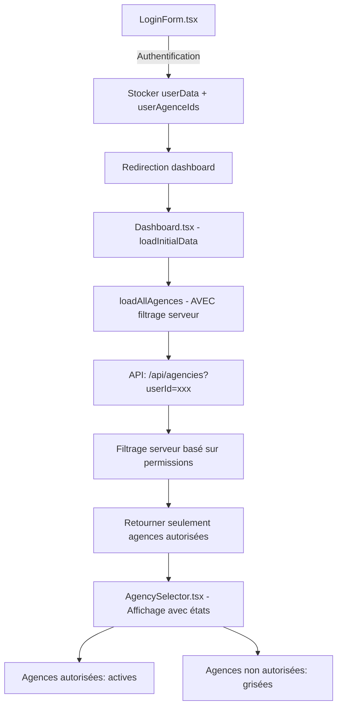

# Plan d'Amélioration de la Sécurité - Sélection d'Agences

## Contexte
Le système actuel affiche toutes les agences sans vérifier les permissions utilisateur. Cette amélioration ajoute un contrôle d'accès basé sur les permissions stockées dans localStorage.

## Spécifications Validées

1. **Affichage** : Toutes les agences visibles, grisées si non autorisées
2. **Gestion d'erreur** : Redirection vers login avec message explicatif
3. **Performance** : Filtrage côté serveur lors du chargement
4. **Admin** : Accès complet à toutes les agences

## Architecture Modifiée



## Modifications Requises

### 1. API Backend - Nouveau Endpoint
**Fichier**: `app/api/agencies/route.ts`
- Créer un endpoint GET `/api/agencies` qui accepte un paramètre `userId`
- Filtrer les agences côté serveur selon les permissions utilisateur
- Retourner les agences avec un indicateur `hasPermission`

### 2. Frontend - Gestion des Permissions
**Fichier**: `utils/dataStore.ts`
- Modifier `loadAllAgencies()` pour utiliser le nouvel endpoint
- Ajouter la gestion des erreurs avec redirection login

**Fichier**: `components/AgencySelector.tsx`
- Modifier la logique de désactivation pour utiliser `hasPermission`
- Maintenir l'affichage de toutes les agences avec états visuels

### 3. Sécurité - Nettoyage
**Fichier**: `components/LoginForm.tsx`
- Nettoyer localStorage avant connexion
- Ajouter validation des données utilisateur

### 4. Admin - Accès Complet
**Fichier**: `app/api/agencies/route.ts`
- Vérifier le rôle admin et bypasser les restrictions si admin

## Plan d'Exécution

### Phase 1: Backend (Serveur)
1. Créer `app/api/agencies/route.ts`
2. Implémenter le filtrage côté serveur
3. Gérer le cas admin

### Phase 2: Frontend - Data Layer
1. Modifier `loadAllAgencies()` dans dataStore.ts
2. Ajouter la gestion d'erreurs avec redirection
3. Mettre à jour les interfaces TypeScript

### Phase 3: Frontend - UI
1. Modifier AgencySelector.tsx pour nouvelle logique
2. Ajouter les états visuels (grisé/actif)
3. Tester l'affichage complet

### Phase 4: Sécurité & Tests
1. Nettoyage localStorage dans LoginForm
2. Tests de sécurité (accès non autorisé)
3. Tests admin (accès complet)

## Structure de Données Modifiée

```typescript
interface AgencyWithPermission extends Agency {
  hasPermission: boolean;
  hasReportingData: boolean;
  isSelectable: boolean;
}
```

## Gestion d'Erreur

```typescript
// Redirection avec message
if (error || !userData) {
  router.push('/login?error=invalid_session');
}
```

## Points de Vérification

- [ ] Endpoint API sécurisé avec validation userId
- [ ] Filtrage côté serveur fonctionnel
- [ ] Affichage grisé des agences non autorisées
- [ ] Accès admin complet
- [ ] Redirection en cas d'erreur
- [ ] Nettoyage localStorage
- [ ] Tests de sécurité