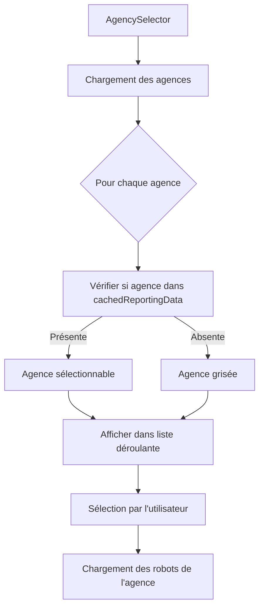

# Plan de correction pour les agences grisées

## Problème identifié
Actuellement, dans le composant `AgencySelector.tsx`, toutes les agences sont grisées (désactivées) dans la liste déroulante. Le comportement attendu est que seules les agences qui ne sont pas dans la liste des reporting `cachedReportingData` devraient être grisées. Si une agence se trouve dans l'une des 4 sous-listes de reporting, alors on doit pouvoir la sélectionner.

## Analyse de la structure des données

### Structure de `cachedReportingData`
Le `cachedReportingData` est un objet de type `MonthlyData` qui contient 4 sous-listes :
- `currentMonth`: Données du mois en cours
- `prevMonth1`: Données du mois précédent (N-1)
- `prevMonth2`: Données du mois N-2
- `prevMonth3`: Données du mois N-3

Chaque sous-liste contient des entrées de type `ReportingEntry` qui ont une propriété `AGENCE` représentant le code de l'agence.

### Logique actuelle dans `AgencySelector.tsx`
Actuellement, le composant utilise la logique suivante pour griser les agences :
```typescript
const agencyRobots = getRobotsByAgency(agency.codeAgence);
const hasRobots = agencyRobots.length > 1;
// ...
disabled={!hasRobots}
```

Cette logique grise les agences qui n'ont pas de robots associés, ce qui n'est pas le comportement attendu.

## Solution proposée

### 1. Créer une fonction pour vérifier la présence dans `cachedReportingData`
Ajouter une fonction dans `utils/dataStore.ts` :

```typescript
/**
 * isAgencyInReportingData
 * -------------------------------------------------------------------
 * Description :
 *  - Vérifie si une agence est présente dans l'une des 4 sous-listes de cachedReportingData.
 *  - Retourne true si l'agence est trouvée, false sinon.
 *
 * Entrée :
 *  - agencyCode: string - Le code de l'agence à vérifier.
 * Sortie :
 *  - boolean - true si l'agence est présente dans les données de reporting, false sinon.
 */
export function isAgencyInReportingData(agencyCode: string): boolean {
  if (agencyCode === 'TOUT') return true;
  
  // Vérifier dans les 4 sous-listes
  const allReportingEntries = [
    ...cachedReportingData.currentMonth,
    ...cachedReportingData.prevMonth1,
    ...cachedReportingData.prevMonth2,
    ...cachedReportingData.prevMonth3
  ];
  
  return allReportingEntries.some(entry => entry.AGENCE === agencyCode);
}
```

### 2. Modifier la logique dans `AgencySelector.tsx`
Remplacer la logique actuelle dans `components/AgencySelector.tsx` :

```typescript
// Importer la nouvelle fonction
import { getRobotsByAgency, cachedRobots, Program, updateRobots, isAgencyInReportingData } from '../utils/dataStore';

// Dans le composant AgencySelector, remplacer :
const agencyRobots = getRobotsByAgency(agency.codeAgence);
const hasRobots = agencyRobots.length > 1;

// Par :
const isAgencyInReporting = isAgencyInReportingData(agency.codeAgence);

// Et remplacer :
disabled={!hasRobots}

// Par :
disabled={!isAgencyInReporting}
```

### 3. Mettre à jour le style CSS
Mettre à jour la classe CSS pour refléter le nouveau comportement :

```typescript
className={`text-sm ${!isAgencyInReporting ? 'opacity-50 cursor-not-allowed' : 'hover:bg-gray-100'}`}
```

## Étapes d'implémentation

1. **Ajouter la fonction `isAgencyInReportingData` dans `utils/dataStore.ts`**
   - Cette fonction vérifie si une agence est présente dans l'une des 4 sous-listes de cachedReportingData
   - Elle retourne true si l'agence est trouvée, false sinon

2. **Modifier le composant `AgencySelector.tsx`**
   - Importer la nouvelle fonction `isAgencyInReportingData`
   - Remplacer la logique de vérification des robots par la vérification dans les données de reporting
   - Mettre à jour le style CSS en conséquence

3. **Tester la modification**
   - Vérifier que les agences présentes dans cachedReportingData sont sélectionnables
   - Vérifier que les agences absentes de cachedReportingData sont grisées
   - S'assurer que l'option "TOUT" reste toujours sélectionnable

4. **Documenter les modifications**
   - Mettre à jour le fichier `HistoriqueDesModifications.md` avec les changements apportés

## Diagramme de flux



## Cas particuliers à considérer

1. **Agence "TOUT"** : Doit toujours être sélectionnable quelle que soit la situation
2. **Agences sans données de reporting** : Doivent être grisées
3. **Agences avec données de reporting** : Doivent être sélectionnables
4. **Performance** : La vérification doit être efficace même avec un grand nombre de données

## Validation

Après implémentation, il faudra valider :
- Que seules les agences présentes dans cachedReportingData sont sélectionnables
- Que l'option "TOUT" fonctionne correctement
- Que le changement d'agence met bien à jour les robots associés
- Que l'interface reste réactive même avec beaucoup de données